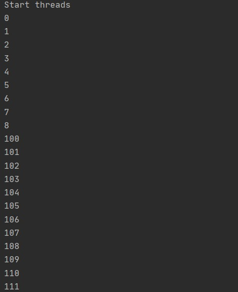
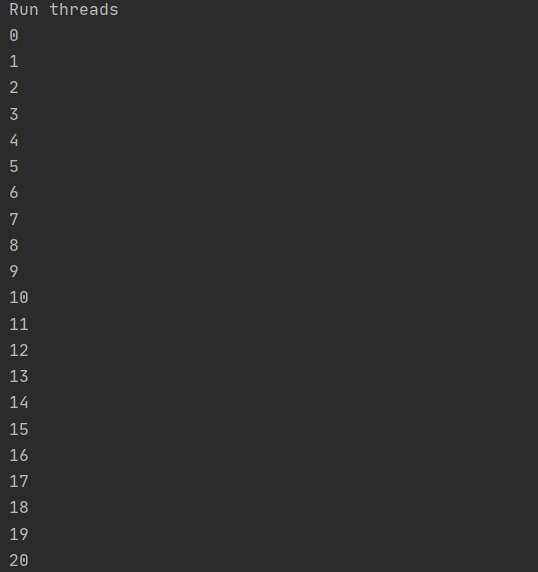

# Arsw-lab1

## Estudiantes

  - Juan Camilo Angel Hernandez
  - Nicolas Aguilera Contreras
  
## Compile and run instructions.
 
- Para compilar: maven package
- Para ejecutar la clase principal: mvn exec:java -Dexec.mainClass="edu.eci.arsw.threads.CountThreadsMain"
- Para ejecutar las pruebas: mvn test

## Part I - Introduction to threads in JAVA

In agreement with the lectures, complete the classes CountThread, so that they define the life cycle of a thread that prints the numbers between A and B on the screen.
Complete the main method of the CountMainThreads class so that: 

1. Create 3 threads of type CountThread, assigning the first interval [0..99], the second [99..199], and the third [200..299]. 

2. Start the three threads with start(). Run and check the output on the screen. 

   Usando el metodo start()
   
   
   
   Usando el metodo run()
   
   

3. Change the beginning with start() to run(). How does the output change? Why?\

   Usando start los hilos se ejecutan en un un orden diferente al especificado en el codigo, mientras que usando run los hilos se inician de acuerdo a la forma especificada en  el codigo. Esto sucede porque al usar el metodo start() se asigna un nuevo hilo y este llama al método run(), esto quiere decir que usando el metodo start() su método run se   ejecuta en hilos separados (simultaneamente), mientras que al llamar el método run() directamente no se crean multiples subprocesos por lo que la ejecución se refleja de forma
   simultanea.
