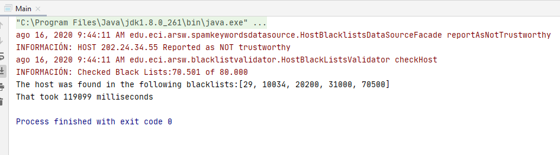
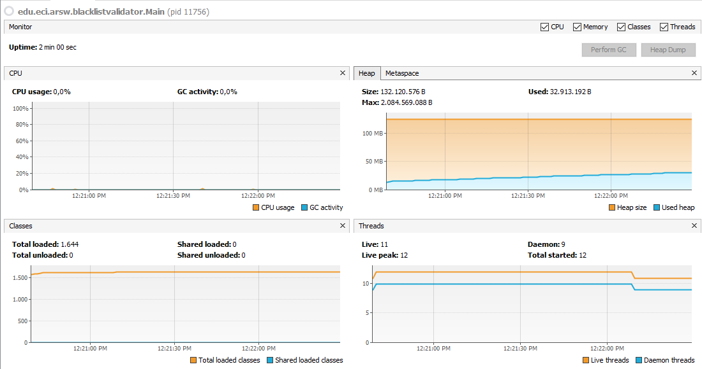
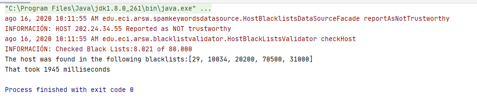
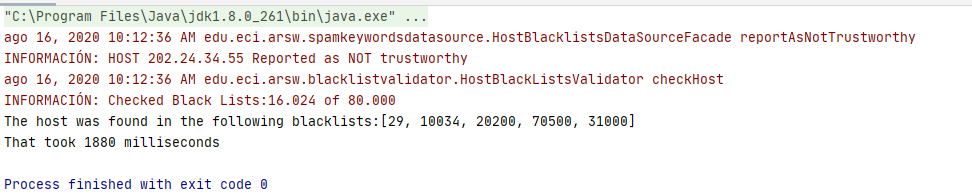
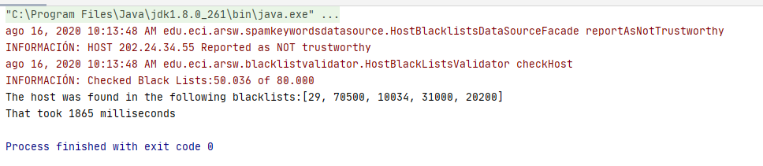
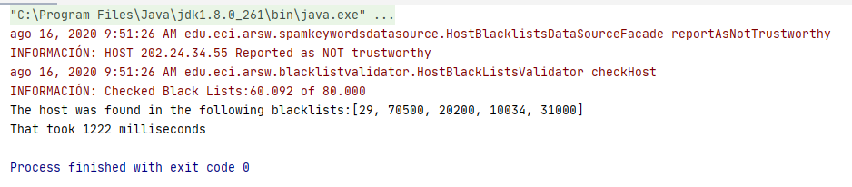

# Part IV - Performance Evaluation 
From the above, implement the following sequence of experiments to perform the validation of dispersed IP addresses (for example 202.24.34.55), taking the execution times of them (be sure to do them on the same machine):
1. A single thread. 
2. As many threads as processing cores (have the program determine this using the Runtime API). 
3. As many threads as twice the number of processing cores. 
4. 50 threads 
5. 100 threads

When starting the program run the monitor jVisualVM, and as you run the tests, review and record the CPU and memory consumption in each case.

1. A single thread. 

2. As many threads as processing cores. 8 Threads

3. As many threads as twice the number of processing cores. 16 Threads

4. 50 threads 

5. 100 threads

